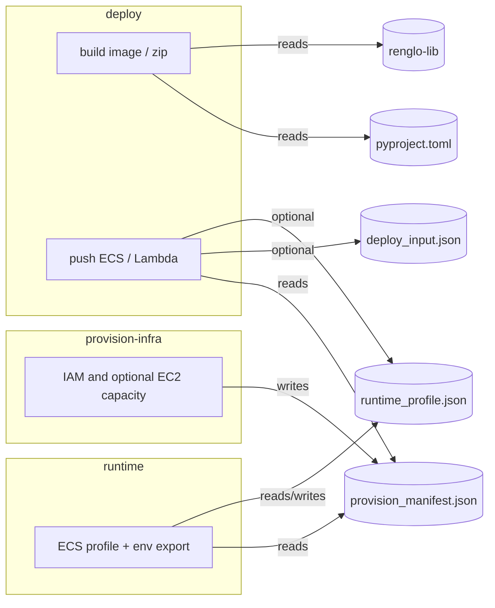

# Deploy flow (overview)

## Which files each stage uses

| Stage | Main inputs |
|-------|-------------|
| **provision-infra** | Writes `state/<ext>/provision_manifest.json` and default `runtime_profile.json` if missing; reads ECS-related env from `deploy_input.json` (or `DEPLOY_INPUT_FILE`) when present to refresh the manifest. |
| **deploy build** | `extensions/<ext>/package/pyproject.toml`, `dev/renglo-lib`, extension package source. |
| **deploy push** | `provision_manifest.json`; `deploy_input.json` (for Lambda env merged into ECS task / required for Lambda deploy paths); optional `runtime_profile.json` (`ECS_PROFILE_FILE`) or ECS profile fallback. |
| **runtime** | `runtime_profile.json`, `provision_manifest.json` → writes `lambda_env_export.json`. |

State JSON files live under `dev/extensions-service/state/<extension>/`.
