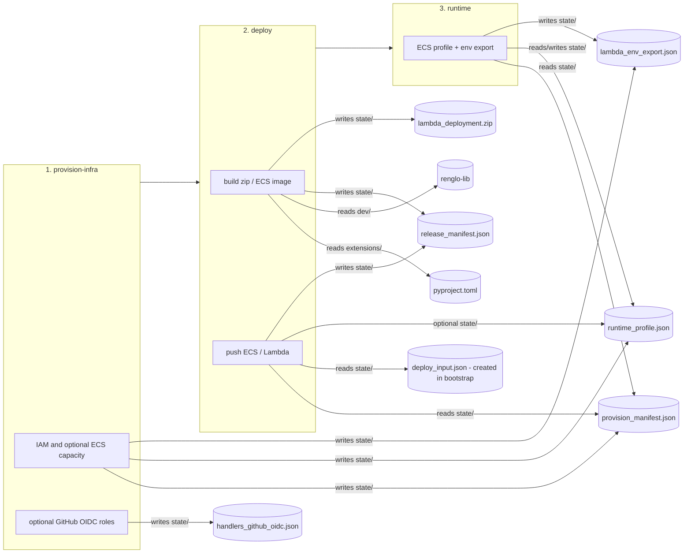

# Extension service (provision-infra + deploy + runtime-config)

Manages the full lifecycle of extension handler deployments across three permission stages, each with a local source of truth under `dev/extensions-service/state/<env>/`.

Short deploy-flow diagram: [DEPLOY_FLOW.md].

## Stages overview

| Stage | Command | Permissions | Output |
|-------|---------|-------------|--------|
| 1 — provision-infra | `provision-infra apply` | Admin (IAM; optional ECR/ECS/S3) | `provision_manifest.json`, optional `handlers_github_oidc.json` |
| 2a — deploy Lambda | `deploy build` + `deploy deploy` (zip) | DevOps (Lambda create/update) | Function `{ext}-handlers` on AWS |
| 2b — deploy ECS | `deploy build` + `deploy push` | DevOps (ECR push, ECS task def) | ECR image + task definition |
| 3 — runtime-config | `runtime set-profile / export-lambda-env` | Moderate (ASG update) | `runtime_profile.json`, `lambda_env_export.json` |

---

## Quick setup guide

Run from the repo root. Replace `<env>` and `<aws-profile>` with your values.

**`<env>`** is the platform environment name (same as `bootstrap/install.py` and launcher). It selects `state/<env>/` and AWS resource prefixes from provision.

**Provision stage:** Is recomendend to be excecuted from the main infra installer, using `bootstrap/install.py`; but it can be done in the main proyect folder (where you have `system/`). But you will not have a pre-made `deploy_input.json`. In both cases, the json must be manally copied into `extensions-service/state/<env>`

**Before stage 2:** place `deploy_input.json` at `dev/extensions-service/state/<env>/deploy_input.json` (see [Stage 2 — deploy]). After bootstrap, copy it from `bootstrap/state/<env>/deploy_input.json`.

**github-repo:** Using this option will create an OIDC configuration for the specified GitHub repository. This can later be used to grant permission to a workflow.yml file in that repository to perform the Build and Deploy phases.

### Lambda only

Provisions handlers IAM + Lambda path only (no ECS cluster, ECR, or S3 results bucket).

1. **Provision (admin, once)**

  ```bash
  python3 dev/extensions-service/run.py <env> provision-infra apply \
    --profile <aws-profile>
    --github-repo <org>/<handlers-repo> #Optional
  ```

2. **Build** the Lambda zip (written to `extensions-service/state`)

  ```bash
  python3 dev/extensions-service/run.py <env> build
  # When <env> and extension have different names:
  python3 dev/extensions-service/run.py <env> build --extension-repo <extension_name>
  ```

  3. **Deploy** the zip to AWS Lambda

  ```bash
  python3 dev/extensions-service/run.py <env> deploy deploy \
    --profile <aws-profile>
  ```

### ECS + Lambda

Provisions handlers IAM plus ECS cluster, ECR, and S3 results bucket. Uses the default VPC for subnets/SG unless you pass `--vpc` (stage 1 options).

1. **Provision (admin, once)**

  ```bash
  python3 dev/extensions-service/run.py <env> provision-infra apply \
    --profile <aws-profile> \
    --launch-type <ec2|fargate>
    --github-repo <org>/<handlers-repo> #Optional
  ```

2. **Build** the Lambda zip and the ECS Docker image (heavy dependencies)

  ```bash
  python3 dev/extensions-service/run.py <env> build --large
  python3 dev/extensions-service/run.py <env> build --large --extension-repo <extension_name>
  python3 dev/extensions-service/run.py <env> build --large --extension-repo <extension_name> --extra-extensions <ext1>,<ext2>
  ```

3. **Deploy** Lambda (zip) and push the ECS image (ECR + task definition)

  ```bash
  python3 dev/extensions-service/run.py <env> deploy deploy \
    --profile <aws-profile>

  python3 dev/extensions-service/run.py <env> deploy push \
    --profile <aws-profile>
  ```

---

## Stage 1 — provision-infra (admin, once per environment)

Creates AWS infrastructure and writes manifests that later stages consume.

**Lambda-only (default — omit `--launch-type`):** Lambda IAM policy + role; `provision_manifest.json` with handlers Lambda ARN. No ECS → stage 2 builds a zip only.

**Lambda + ECS (`--launch-type ec2` or `fargate`):** ECR `{ext}-handlers-ecs`, S3 results bucket, ECS cluster, task roles, subnets/SG (default VPC or `--vpc`). EC2 also gets ASG + capacity provider.

Re-running without `--launch-type` on an environment that already has ECS refreshes Lambda IAM and preserves ECS sections (does not tear down ECS).

**Handlers IAM policy:** Always generated at apply time (ECS invoke + S3 handshake). 

```bash
python3 dev/extensions-service/run.py <env> provision-infra apply \
  --profile <aws-profile>
```

Optional:

| Flag / subcommand | When to use |
|-------------------|-------------|
| `--launch-type ec2` | ECS on EC2 (ASG + capacity provider) |
| `--launch-type fargate` | ECS on Fargate |
| `--vpc vpc-...` | Non-default VPC (subnets/SG discovered from it) |
| `--github-repo Org/handlers-repo` | GitHub OIDC for handlers CI → `handlers_github_oidc.json` |
| `--enable-handlers-staging-role` | Second OIDC role for GitHub Environment `staging` |

**Other commands (optional):**

Export env vars for `launcher/vars.json` and write `state/<env>/lambda_env_export.json`:

```bash
python3 dev/extensions-service/run.py <env> provision-infra export
```

Tear down EC2 capacity only (cluster and IAM kept):

```bash
python3 dev/extensions-service/run.py <env> provision-infra destroy \
  --profile <aws-profile>
```

Delete all provisioned AWS resources and local `state/<env>/`. Use flag `--keep-logs` to Keep CloudWatch log groups when tearing down:

```bash
python3 dev/extensions-service/run.py <env> provision-infra teardown \
  --profile <aws-profile> --yes --keep-logs
```

---

## Stage 2 — deploy (DevOps / CI profile)

Stage 2 has two publish paths: Lambda (zip) and ECS (Docker image). Docker is a build tool in both cases; only the ECS path pushes to ECR.

| Target | Build | Publish to AWS |
|--------|-------|----------------|
| Handlers Lambda | `build` | `deploy deploy` / `deploy update` |
| Handlers ECS| `build` (auto if ECS provisioned) or `build --large` | `deploy push` |

`deploy push` does not deploy Lambda. For Lambda-only environments, stop after `deploy deploy`.

Stage 2 needs `dev/extensions-service/state/<env>/deploy_input.json`. Can be generated by `bootstrap/install.py`, and must have shape as defined in `extensions-service\state\schemas\deploy_input.schema.json`

Optional: `provision_manifest.json` and `runtime_profile.json` in the same state directory override or supplement some deploy settings when present.

### `build` / `deploy build`

`build` always produces the Lambda zip (light image). With ECS provisioned, it also builds the ECS image unless you pass `--no-ecs`.

**`build --large`** builds both artifacts in one run: the light Lambda zip (for `deploy deploy` → AWS Lambda) and the "heavy" Docker image with `[large-dependencies]` (for `deploy push` → ECR → ECS tasks). Use it for Lambda + ECS workflows so you do not need separate build commands.

```bash
python3 dev/extensions-service/run.py <env> build
```

**Optional:**

| Flag | When to use |
|------|-------------|
| `--extension-repo` | Handler source folder when it differs from `<env>` |
| `--extra-extensions` | Comma-separated extra extensions to bundle alongside the primary one. Their Python packages, dependencies, and `handlers_config.json` entries are merged into the artifact. |
| `--large` | Force ECS image build (heavy deps) even before ECS is provisioned, or when you want zip + ECS image together |
| `--no-ecs` | Lambda zip only, skip ECS image even if `provision_manifest.json` has ECS |
| `--local` | Lambda zip for `run-local` on arm64 (ECS image stays amd64) |

| Build output | Used by |
|--------------|---------|
| `extensions-service/state/<env>/lambda_deployment.zip` | `deploy deploy` / `deploy update` |
| `<env>-ecs-builder:latest` image | `deploy push` |

### `deploy deploy` / `deploy update` / `deploy undeploy`

Uses `deploy_input.json` and `state/<env>/lambda_deployment.zip`. Subcommands map to `deploy_as_a_service.sh` (creates/updates the `{ext}-handlers` function).

```bash
python3 dev/extensions-service/run.py <env> deploy deploy \
  --profile <aws-profile>
```

**Optional:**

| Flag / subcommand | When to use |
|-------------------|-------------|
| `deploy update` | Update code/config on an existing function (preferred in CI) |
| `deploy deploy --clean` | Delete and recreate the function |
| `deploy undeploy` | Remove the Lambda function |
| `--type ecs` | Legacy: build large image + run ECS push in one step (prefer `build --large` + `deploy push`) |
| `--type default` | Zip Lambda, then ECS if extension config lists ECS handlers |

### `deploy push`

ECS only. Pushes the Docker image to ECR and registers/updates the task definition (`deploy_ecs.sh`). Reads cluster, ECR, and bucket from `provision_manifest.json` and/or `deploy_input.json` `VARS`.

```bash
python3 dev/extensions-service/run.py <env> deploy push \
  --profile <aws-profile>
```

### `deploy publish` (optional)

Record a completed ECS release in `release_manifest.json` (no AWS changes; optional bookkeeping for CI or audit):

```bash
python3 dev/extensions-service/run.py <env> deploy publish --type ecs
```

`--type` is only a label stored as `last_publish.target` (default `ecs`). It does not choose Fargate vs EC2. 

---

## Stage 3 — runtime-config (tuning, no re-provision)

Adjust compute sizing (Fargate vs EC2, instance type, ASG) without reprovisioning infra. After profile changes, run `export-lambda-env` to refresh values for `launcher/vars.json`.

```bash
python3 dev/extensions-service/run.py <env> runtime set-profile --medium
```

**Optional:**

| Flag | When to use |
|------|-------------|
| `--large` / `--medium` / … | Preset CPU/memory |
| `--launch-type ec2` / `fargate` | Launch type |
| `--network-mode bridge` / `awsvpc` / … | ECS network mode |
| `--ec2-instance-type m5.2xlarge` | EC2 instance type |
| `--asg-min-size`, `--asg-desired-capacity`, `--asg-max-size` | ASG sizing |
| `runtime export-lambda-env` | Refresh `lambda_env_export.json` |

---

## Other commands

| Command | Purpose |
|---------|---------|
| `list` | List extensions (`extensions/<name>/package/`) |
| `setup-iam` | Lambda handlers IAM only (subset of stage 1) |
| `provision-ecs-capacity` / `undeploy-ecs-capacity` | EC2 ASG capacity without full provision |
| `deploy publish --type ecs` | Optional: mark release complete in `release_manifest.json` (no AWS) |
| `run-local <handler>` | Invoke handler locally via Docker |
| `view-logs` | CloudWatch logs for handlers Lambda |
| `test <handler>` | Invoke handler on AWS Lambda |

```bash
python3 dev/extensions-service/run.py <env> run-local <handler_name>
python3 dev/extensions-service/run.py <env> view-logs --follow
python3 dev/extensions-service/run.py <env> test <handler_name>
```

---

## State files

All under `dev/extensions-service/state/<env>/` — gitignored except `state/schemas/`.

| File | Written by | Role |
|------|-----------|------|
| `deploy_input.json` | Bootstrap merge (copy in) | **Required for stage 2** — `VARS` / `SECRETS` for deploy and handlers GitHub Environment |
| `provision_manifest.json` | `provision-infra apply` | Optional; overrides some deploy values when present |
| `runtime_profile.json` | `provision-infra apply`, `runtime set-profile` | Optional ECS sizing / launch type |
| `handlers_github_oidc.json` | `provision-infra apply` + `--github-repo` | Handlers OIDC metadata (merged into `deploy_input` at bootstrap) |
| `release_manifest.json` | `deploy build` / `push` (optional `publish`) | Local audit trail: last build, last push image URI, optional `last_publish` marker |
| `lambda_deployment.zip` | `build` | Lambda zip artifact for `deploy deploy` / `deploy update` |
| `lambda_env_export.json` | `provision-infra export`, `runtime export-lambda-env` | For `launcher/vars.json` (stage 3) |

---

## Per-extension repo layout

**Platform env vs handler repo:** `<env>` names state and AWS resources. Handler code may live under a different folder; use `build --extension-repo <folder>` when it does (aligned with bootstrap `--extension-specific` for provision).

| Path | Role |
|------|------|
| `<folder>/package/` or `extensions/<folder>/package/` | Handler source (`pyproject.toml`, `handlers_config.json`) — selected via `build --extension-repo` |
| `extensions-service/state/<env>/lambda_deployment.zip` | Build output consumed by deploy |
| `extensions-service/state/<env>/` | Manifests + deploy input (gitignored except `schemas/`) |

---

## Optional dependencies and `[large-dependencies]`

In `extensions/<name>/package/pyproject.toml`:

- **`[project.dependencies]`** — Lambda zip (keep small)
- **`[project.optional-dependencies] large-dependencies`** — heavy libs for `build --large` / ECS image only

If `pip install` fails, the build retries with `--only-binary` for packages in `dev/extensions-service/wheel_libs.json`.

---

## Notes

**Handlers Lambda vs launcher backend Lambda:** This service deploys **`{ext}-handlers`** as a zip. The **backend** Lambda and its ECR repo come from **bootstrap → launcher**, not from `deploy push` here.

**`launcher/vars.json` ECS entries** — refresh with `provision-infra export` or `runtime export-lambda-env` after VPC or profile changes.

**Windows / WSL:** if shell scripts fail with `\r` errors:

```bash
sed -i 's/\r$//' dev/extensions-service/scripts/*.sh
```

## Deploy flow chart


